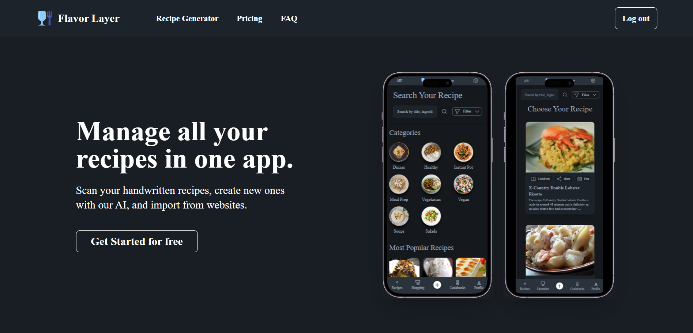
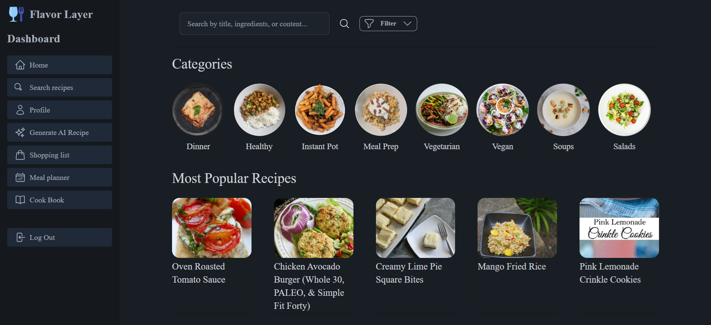
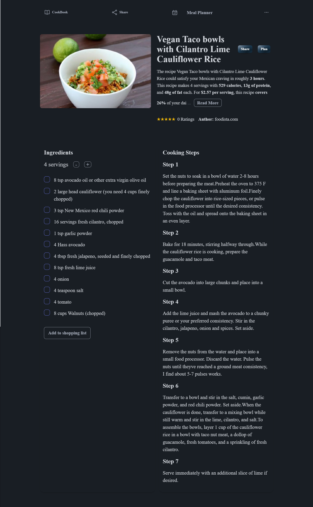
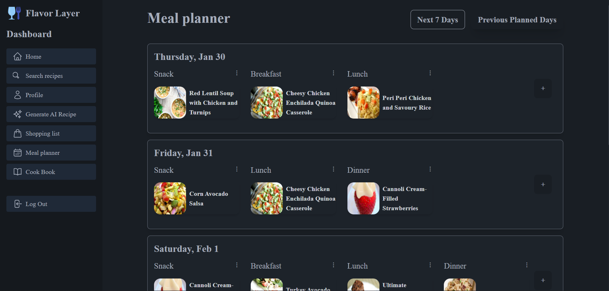
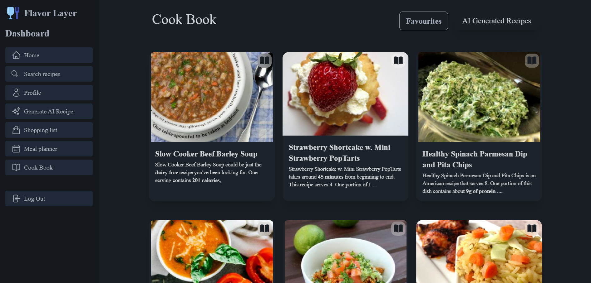

# Flavor Layer

## Slogan

**Personalized Recipes and Meal Planning Made Easy with AI.**

## Description

Flavor Layer is a recipe app designed to help users explore, create, and plan meals tailored to their preferences, dietary requirements, and lifestyle. Users can search recipes, filter by categories, and save their favorites. Additionally, the AI-powered recipe generator creates custom recipes from scratch. The app also features a meal planner, shopping list, and cookbook, all stored securely using Firebase.

### Core Features

1. **Recipe Search & Filtering**: Filter recipes by dietary needs, cooking difficulty, and preferences.
2. **Popular Recipes**: View the 20 most popular recipes of the day.
3. **Recipe Details**: Access cooking instructions, ingredients, nutritional info, and descriptions.
4. **Meal Planner**: Plan meals for 7 days with options for breakfast, snack, lunch, and dinner.
5. **AI Recipe Generator**: Generate personalized recipes based on your input.
6. **Shopping List**: Add missing ingredients to your shopping list.
7. **Cookbook & Saved Recipes**: Save your favorite recipes and AI-generated dishes.
8. **Profile Management**: Track saved recipes, shopping lists, and planned meals.
9. **Authentication**: Sign up and log in with Google or email using Firebase.
10. **Data Storage**: All data is securely stored in Firebase.

---

## Technologies

- **Frontend**:

  - React.js, Vite
  - TailwindCSS for styling
  - Firebase for authentication and data storage
  - daisy Ui for styled components

- **Backend**:
  - Firebase for user data management

---

## Live Demo

[Check out the live demo here](https://flavor-layer.com/)

---

## Table of Contents

1. [Features](#features)
2. [Screenshots](#screenshots)
3. [Installation](#installation)
4. [Usage](#usage)
5. [Support](#support)
6. [License](#license)

---

## Features

- **User Registration & Authentication**: Secure sign-up and login via Google or email using Firebase.
- **Recipe Search & Filtering**: Search for recipes based on dietary requirements, cooking difficulty, and lifestyle preferences.
- **Popular Recipes**: View the top 20 popular recipes of the day.
- **Recipe Details**: View ingredients, cooking instructions, nutritional information, and a description for each recipe.
- **Meal Planner**: Plan meals for the next 7 days, with options for breakfast, snack, lunch, and dinner.
- **AI Recipe Generator**: Generate personalized recipes based on user input.
- **Shopping List**: Add ingredients to your shopping list if you don't have them.
- **Cookbook**: Save favorite recipes and AI-generated dishes to your personal cookbook.
- **Meal Planning**: Add recipes to your meal plan and assign them to specific days and meals.
- **Profile Management**: Track saved recipes, shopping lists, meal plans, and AI-generated recipes.

---

## Screenshots

### Homepage



### Recipe Search



### Recipe Details



### Meal Planner



### Cook Book



### Profile


---

## Installation

To get started with the Whips Car Rental app on your local machine, follow these steps:

1. **Clone the Repository**
   ```bash
   git clone https://github.com/abdinasir1warsame/recipe-application-deployed.git
   ```
2. **Navigate to the Project Directory**

   ```bash
   cd deployed-recipe-app
   ```

3. **Install Dependencies**
   ```bash
   npm install
   ```
4. **Install Dependencies**

   ```bash
   npm run dev
   ```

   ## Usage

Once the app is set up and running, you can:

- **Sign Up/Login**: Create a new account or log in using Google or email.
- **Search Recipes**: Filter and search for recipes based on dietary requirements, preferences, and difficulty.
- **View Recipe Details**: Check ingredients, instructions, and nutritional information for any recipe.
- **AI Recipe Generator**: Generate personalized recipes by providing specific prompts.
- **Meal Planner**: Plan your meals for the week, with options for breakfast, snacks, lunch, and dinner.
- **Manage Cookbook**: Save recipes to your personal cookbook and create your shopping list.

## Environment Variables

To run the app, set up the environment variables as outlined in the `.env.example` file. These variables include configurations for database connections and API keys for integrated services. Ensure these variables are accurately set for proper functionality.

## Deployment

The application is hosted on **Vercel**. To deploy your own version, follow the [Vercel deployment guidelines](https://vercel.com/docs) or use your preferred hosting service. Make sure that all environment variables and dependencies are correctly configured before deployment.
